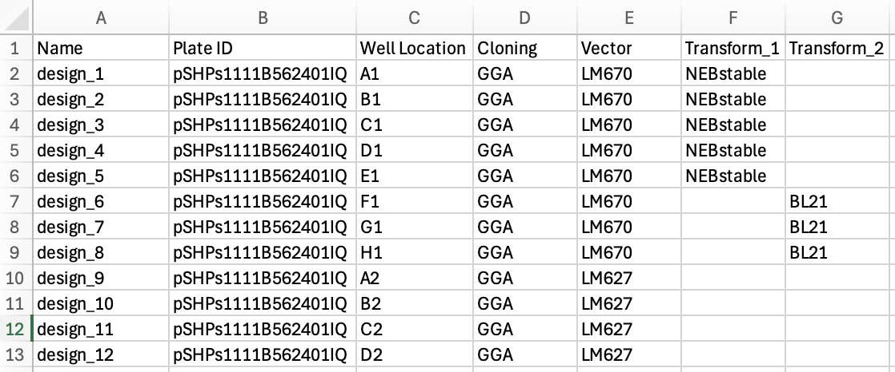

# Cloning Module
This module contains code to automatically clone entire Twist plates on the Tecan Fluent liquid handling platform. 
```
Note: this is highly specific to the setup of the Tecan Fluent and the corresponding method in Fluent Control
```

## Usage
First, the information for cloning (assemblies) and transformation needs to be added to the plate map from Twist. See the example [excel file](../../examples/example_data/cloning/plate_map_test.xlsx) for how the excel should look like. The excel needs to look like this:

It must contain the columns ```Name```, ```Plate ID```, ```Well Location```, ```Cloning```, ```Vector```, ```Transform_1```, ```Transform_2```.

### Cloning Method
The cloning method is specified in the ```Cloning``` column. You can choose ```Gibson``` or ```GGA``` (Golden Gate Assembly). If you do not want a well being cloned by the robot, simply don't specify the cloning method and the respective position will be omitted from the method completely (including transformation).

### Vector Choice
The target vector for the assembly is specified in the ```Vector``` column. The available options are:
- LM670
- LM627
- pHLSec
- pHLSec_fc
- Custom_1
- Custom_2
- Custom_3

### Transformation Strain
The assembled plasmids can be transformed into up to 2 strains. The strains can be specified in the columns ```Transform_1``` and ```Transform_2```, respectively. The available strains are:
- HB101
- T7Express
- DH5a
- NEBStable
- BL21
- Custom_1
- Custom_2
- Custom_3

If you don't want your assembled plasmid to be transformed, simply do not add any strain to the respective columns. Note the difference between ```Transform_1``` and ```Transform_2```: bacteria from ```Transform_1``` will be recovered in a flat 96 well plate (round bottom) and can easily plated on agar plates using a multi-channel pipette. Bacteria from ```Transform_2``` will be recovered in a 96 deep-well plate such that after recovery growth media with the respective antibiotics can be added to grow pre-cultures for expression.

### Generating gwl files
After adding the required information to the excel file, convert it into gwl files which contain the pipetting instruction for the robot:
```python
import wetlabtools

plate_map = "./example_data/cloning/plate_map_test.xlsx"
gwl_location = "./example_data/cloning"

df, cloning_df, transform_1_df, transform_2_df = wetlabtools.cloning.tecanfluent.make_cloning_worklists_from_twist(plate_map, gwl_location)
```
The plate map is the path to the excel file you just created and the gwl location is the path to the location where the output files should be created. Transfer the worklists to the computer running the robot and use them in the respective method.